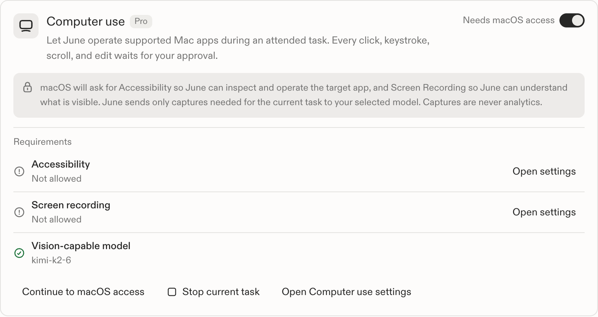
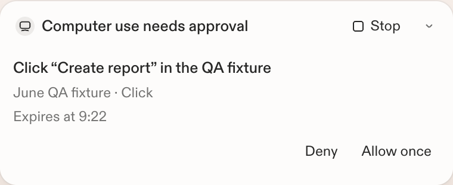

# Computer use parity and acceptance matrix

Date: 2026-07-16
Scope: JUN-278 phase 2, JUN-288, JUN-293, JUN-296
Baseline: the attended macOS Computer Use experience documented for Codex on
2026-07-15.

This matrix defines parity by user outcome, not by reusing another product's
implementation. June deliberately applies stricter mutation and sensitive-data
policy where the PRD requires it.

## Outcome matrix

| Outcome | June behavior | Evidence and release gate |
| --- | --- | --- |
| Discover and enable | The top-level Plugins page contains the complete Computer use control, with no duplicate Settings entry. | `PluginsView`, `ComputerUseControl`; component tests. |
| Understand access before prompts | The tile explains Accessibility, Screen Recording, selected-model routing, and that captures are not analytics before the explicit Continue action. Enabling the grant alone never opens a macOS prompt. | `computer-use-control.test.tsx`; manual first-run walkthrough. |
| Install safely | A June-owned helper is compiled from one exact upstream source commit. The upstream CLI, daemon, updater, full registry, and executable are not shipped. Universal builds merge arm64 and x86_64 slices, then sign and bundle the helper. | Git/Cargo pin, source fingerprint, SPDX SBOM, license, `prepare-cua-driver.mjs`, deterministic self-test. |
| Grant and inspect macOS access | Accessibility and Screen Recording are separate states with direct System Settings links. Readiness requires both preflight and a live ScreenCaptureKit probe for the helper identity. Local dev uses a stable identity per worktree and resets only that identity on each `make dev` launch. | Native status tests, `computer-use-dev.test.mjs`, plus signed live release fixture. |
| Use a compatible model | The selected generation model must have authoritative vision capability. The current model and a Choose model action are shown. | Native readiness gate and component tests. |
| Meet plan eligibility | Computer use is available to active Pro and Max subscriptions; legacy paid subscriptions without a plan slug remain compatible. Education and revocation remain visible without an eligible plan. | Native plan tests and UI plan-gate test. |
| Choose a target app | June can list allowed running apps and select an exact app/window without raising it. June, terminals, security tools, and credential managers are omitted or rejected. | Broker allow/deny tests; live multi-window fixture. |
| Open a missing app | June asks once to use the installed app for the current task, opens it by display name, then returns only verified app/window identity. Paths, URLs, launch arguments, environment, debug ports, and forced new processes are unavailable. | Helper schema/argument tests; broker blocked-name and post-launch identity checks; live TextEdit walkthrough. |
| Restore a parked window | Window bounds and visibility are returned. June collapses a full-size hidden window plus its small shelf proxy to the real Accessibility window. After app authorization, it automatically raises that window into June's current Stage Manager group without a second decision or pointer movement, then re-lists and verifies it. | Stage Manager duplicate-collapse and classification tests, exact-PID/window helper contract, task-scoped authorization test, manual Stage Manager walkthrough. |
| Capture a bounded target | Capture addresses one exact process/window and returns a bounded AX tree plus the selected window image. Only the latest local capture remains, with private filesystem permissions. | Broker capture parsing, size/type/digest tests; signed live fixture. |
| Work in the background | Element actions use AX/background delivery; coordinates are window-local and posted to the target. The real pointer and frontmost app must not change. | Driver contract fixture; signed target/observer release test. Active-Space behavior is also checked in the manual support matrix. |
| Act across Mac apps | A task can recapture and retarget multiple allowed apps. The first access to each verified app requires its own authorization; later actions in the same app do not ask again during that task. | Broker authorization-key and stale-target tests; manual two-app walkthrough. |
| See app access before it begins | The always-mounted chat tray names the target app, explains the current-task scope, shows expiry, and offers Deny or Allow for this task before the first capture or action. | Authorization registry and `ComputerUseApprovalsTray` component tests. |
| Keep approval native | The agent invokes the requested operation instead of asking for `yes` in chat. The first blocked call resumes from the native Allow for this task or Deny result. Product-facing copy calls the capability Computer use and does not expose its transport. | Agent schema contract self-test and approval tray test. |
| Approve or deny once per app | Each verified app has one task-scoped decision. There is no cross-task, approve-all, allow-always, or autonomous option. | UI tests and Rust app-authorization registry. |
| Prevent approval races | After approval, the exact window must still exist. Numbered controls must retain role and label; coordinate/key targets must retain the screenshot digest. | Stale capture and element tests. |
| Stop or take over | Stop immediately increments the task epoch, denies parked actions, kills the private driver child, clears the target/captures, and leaves the grant available for a later attended task. | Native stop semantics and live driver-exit test. |
| Stay attended | Only a turn submitted from visible June chat receives both the loopback token and a unique native run lease. A routine, manually named MCP server, restored background process, or task after Stop has no lease. | Hermes config tests, routine sanitization tests, native lease gate, app lifecycle integration. |
| Revoke | Turning the shared grant off performs the same stop path and removes the MCP server from the usable runtime. The UI explains that macOS TCC grants remain until removed in System Settings. | Shared grant integration and component tests. |
| Recover from permission/model changes | The UI polls while setup is incomplete. A real readiness transition reconfigures Hermes once; loss of readiness also stops active work. | Native runtime-readiness transition and UI polling behavior. |
| Recover from driver failure | A failed driver call discards and kills the child. The next eligible request starts a new private child; version/stamp mismatches fail closed. | Native lifecycle code, pin tests, self-test failure modes. |
| Keep routines out | The app-owned MCP server is never included in routine toolsets or earned-autonomy servers. | Rust config tests and `hermes-routines.test.ts`. |
| Stop a bad rollout | June API can disable the capability globally or for an exact/prefix June or macOS version. The desktop fails closed on its first unavailable decision and stops active work when readiness is lost. | API decision/unit and HTTP-boundary tests, desktop native gate, rollout UI test. |
| Ship only proven builds | RC and stable workflows require the pre-granted Mac Studio and run the signed capture/background-action fixture before notarization and publication. Staging also verifies the signed bundle and contract. | `computer-use-release-self-test.sh` and desktop release workflows. |

## Deliberately stricter than the baseline

- Every target app requires a separate current-task authorization before June
  captures or changes it.
- June offers no cross-task Allow always, approve-all, or autonomous mode.
- Computer use cannot operate June itself, terminals, System Settings,
  keychains, password managers, installers, security agents, or other blocked
  administration surfaces.
- It cannot enter passwords, secrets, one-time codes, payment details, or use
  clipboard and destructive/system shortcuts.
- It is unavailable to routines, locked/background sessions, Windows, and
  models without vision support.
- Its helper rejects direct launch and requires a signed June parent plus a
  fresh in-memory initialization capability.
- It fails a delayed approval when the target image or control changed instead
  of guessing that the action is still safe.

These differences preserve the baseline outcomes of app selection, capture,
background control, visible progress, approval, stop/takeover, and revocation
while honoring June's accepted PRD.

## Implementation QA evidence

The implementation pass on 2026-07-16 exercised the real helper against two
signed disposable Mac app fixtures. The live test captured the background
target, clicked and typed through Accessibility, and verified that the
foreground app, pointer, physical key and modifier state, and active Space did
not change. The helper's direct-launch refusal, authenticated MCP handshake,
closed tool schemas, exact upstream pin, source fingerprint, universal
architectures, bundle metadata, and code signature were also checked.

The production React surface was then exercised in an isolated June QA app and
browser harness across `off`, `permission_missing`, `model_unsupported`,
`plan_required`, `driver_missing`, `rollout_disabled`, `unsupported`, and
`ready`. Both Allow for this task and Deny removed the parked app authorization
without a batch or persistent-authorization path.

## Required walkthrough before release

1. Start with the June grant off and both helper TCC grants absent. Confirm the
   switch shows education without prompting.
2. Enable the grant, choose Continue, deny each macOS prompt once, and verify
   the states remain distinct and the tool stays unavailable.
3. Grant both permissions to the signed helper and verify the UI becomes Ready
   without restarting June.
4. Use a supported vision model to list two fixture apps and capture the
   background target.
5. Ask June to open TextEdit when it is not running. Allow it for the task and
   verify a usable document window is returned without a textual approval
   request.
6. Put TextEdit in the Stage Manager shelf. Verify its thumbnail is marked as
   needing restore, then verify June adds TextEdit to June's current group and
   captures the full document window without a second decision.
7. Click, type, scroll, and recapture TextEdit. Verify none asks again and the
   real pointer and active Space do not change.
8. Retarget another allowed app. Deny its first-use authorization and verify the
   app is not captured or changed.
9. End the task, start a new one, and target TextEdit again. Verify June asks
   once again before access.
10. Park an app authorization and press Stop. Verify the card disappears, the
    child exits, the action does not run, and captures are removed.
11. Revoke the June grant during an active task. Verify the same stop behavior
   and that macOS permissions remain independently removable.
12. Repeat model mismatch, driver mismatch, helper crash, app quit, multiple
    windows, modal, menu, text, list, and scrolling cases on the oldest and
    newest supported macOS versions.

The deterministic and signed live fixtures are release blockers. The broader
manual matrix remains the RC dogfood gate because TCC denial UI, cross-Space
placement, and OS update behavior cannot be made reliable on ephemeral hosted
runners.
